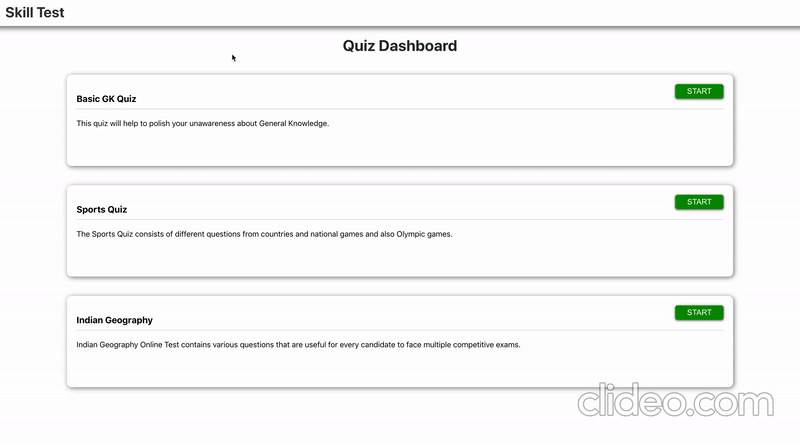
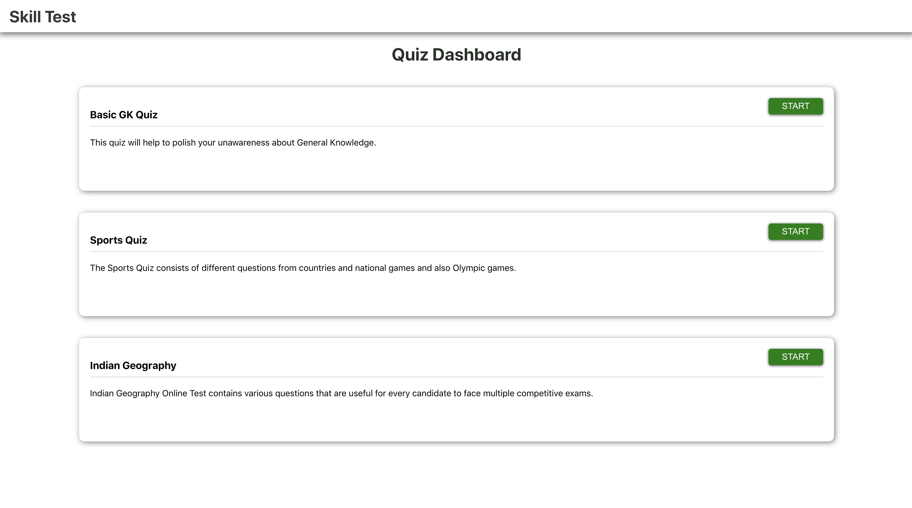
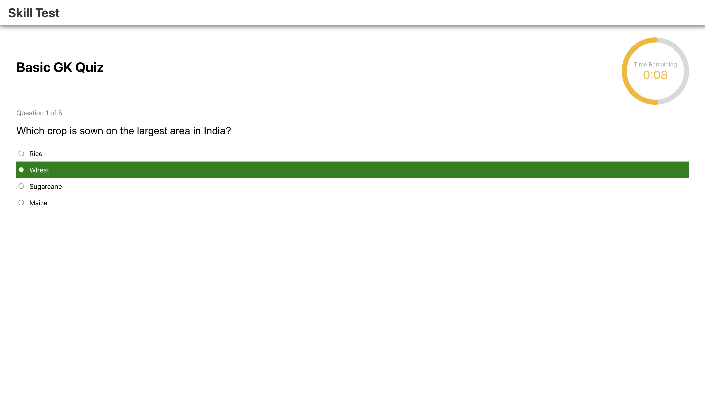
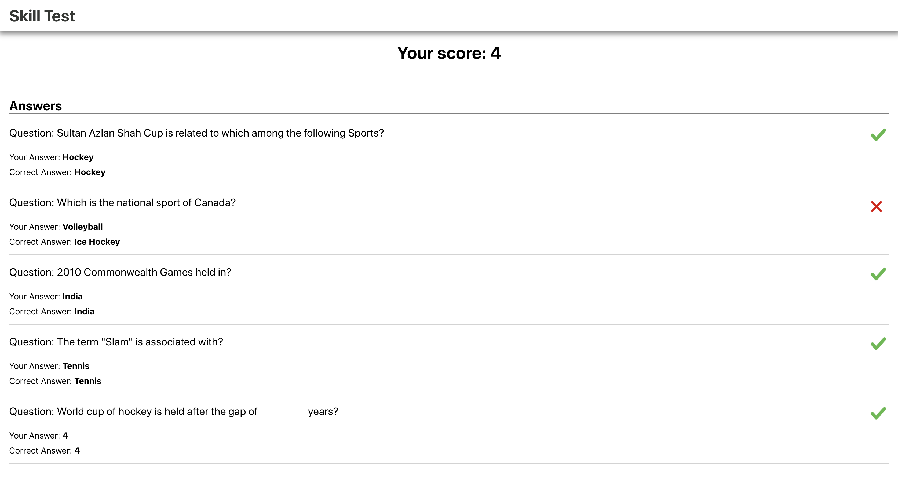

## Project Overview

A minor quiz application with timer animations and with some questions too😝

## Demo Images

## Steps to run

### Clone the repo 

<code>git clone https://github.com/dineshnadimpalli/quizApp.git</code>

### Install the dependencies

<code>npm i</code>

### Start the project

<code>npm start</code>

## Happy Coding ✌️👨🏻‍💻